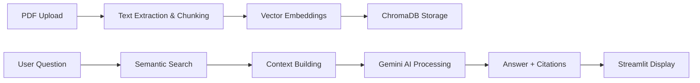

# 🤖 DocuMentor-RAG: Your Intelligent PDF Companion

**DocuMentor** - AI-powered document assistant that reads PDFs so you don't have to! Ask questions in natural language and get instant answers with proper citations. ✨

## 🚀 What Makes This Special?

- **📄 PDF Intelligence**: Upload any PDF and chat with it like a knowledgeable expert
- **🔍 Smart Citations**: Every answer comes with clickable page references
- **💬 Conversational Memory**: Remembers your chat history within each session
- **🎯 Accurate Answers**: Powered by Google's Gemini AI with RAG architecture
- **⚡ Easy to Use**: Beautiful Streamlit interface - no technical knowledge needed!

## 🏗️ How It Works 

## Performance Evaluation

Built-in RAGAS evaluation ensures quality answers:

**Faithfulness Score:** 1.0000 (Answers stay true to source material)

**Answer Relevancy:** 0.6533 (Continuously improving!)

## Project Structure

DocuMentor-RAG/
│

├── app_streamlit.py          -- Main Streamlit application

├── rag_notebook.ipynb        -- Jupyter notebook with RAG development

├── Flowchart.pdf             -- Flow of the project

├── H-046-029216-00-4.0-hybase-v6-user-manual-en  -- PDF that i used

├── README.md                 -- This awesome documentation!

## Thank you for checking out this project! ❤️

    
    

